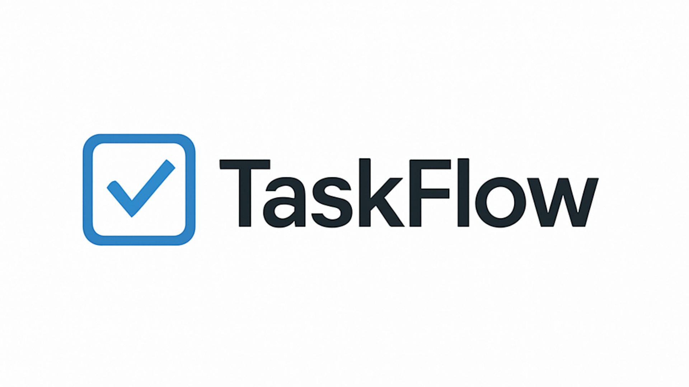

# ✅ TaskFlow

<div align="center">
  
</div>

<div align="center">
  <strong>Aplicação web para organização de tarefas com praticidade e eficiência</strong>
</div>

---

## 🛠️ Tecnologias Utilizadas

<div align="center" style="display: flex; gap: 15px; flex-wrap: wrap;">
  
  
  
  
  
  
</div>

---

## 🚀 Funcionalidade

O **TaskFlow** é uma aplicação voltada para o gerenciamento de tarefas. Permite:
- ✅ Criar tarefas com título e descrição
- 🖊️ Editar tarefas existentes
- ❌ Excluir tarefas concluídas ou desnecessárias
- 📋 Visualizar tarefas pendentes e concluídas separadamente

---

## 🖥️ Executando Localmente

Para executar o projeto localmente em seu ambiente de desenvolvimento, siga os passos abaixo:

1. **Clone o repositório via Git** ou **faça o download manualmente**:
   
   - **Git**:
     ```
     git clone https://github.com/NathaLopesZerbo/TaskFlow.git
     ```

   - **Download Manual**:
     - Clique em "Code" no repositório GitHub e selecione "Download ZIP".
     - Ao fazer o download em formato `.zip`, o nome da pasta será `TaskFlow-main`.
     - **Renomeie a pasta** para `taskflow`.

2. **Mova a pasta do projeto para o diretório de projetos do XAMPP**:
   - Se você usou o Git, a pasta já estará com o nome `taskflow`, mas se você fez o download em `.zip`, será necessário renomeá-la para `taskflow`.
   - Mova a pasta `taskflow` para o diretório `htdocs` do XAMPP:
     - **C:\xampp\htdocs\taskflow**

3. **Acesse o projeto localmente**:
   - Após mover a pasta, abra o navegador e acesse o endereço:
     ```
     http://localhost/taskflow/src
     ```

      4. **Acesso imediato**:
       - Hospedado em InfinityFree:
         ```
         http://taskflow.kesug.com 
         ```


  


