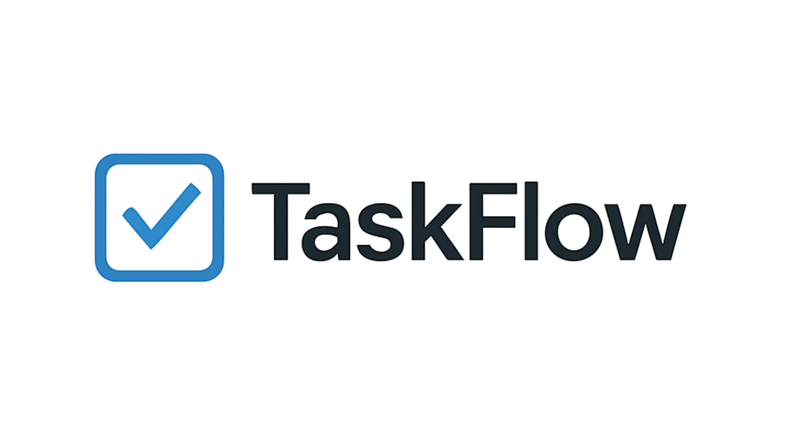

<div align="center">
  
</div>

<div align="center">
  <strong>Aplicação web para organização de tarefas com praticidade e eficiência</strong>
</div>

---

## 🛠️ Tecnologias Utilizadas

<div align="center" style="display: flex; gap: 15px; flex-wrap: wrap;">
  
  
  
  
  
  
</div>

---

## 🚀 Funcionalidades

O **TaskFlow** é uma aplicação web desenvolvida para o gerenciamento eficiente de tarefas. Suas principais funcionalidades incluem:

- ✅ **Criação de Tarefas:** Permite adicionar novas tarefas com título e descrição detalhada.
- 🖊️ **Edição de Tarefas:** Possibilidade de modificar tarefas existentes para atualizar informações.
- ❌ **Exclusão de Tarefas:** Facilidade para remover tarefas concluídas ou que não são mais necessárias.
- 📋 **Visualização Organizada:** Apresenta as tarefas pendentes e concluídas em seções separadas para melhor organização.

---

## 🖥️ Executando Localmente

Para executar o **TaskFlow** em seu ambiente de desenvolvimento local, siga estas etapas:

1. **Obtenha o código do projeto:**

   - **Via Git (recomendado):**
     ```bash
     git clone [https://github.com/NathaLopesZerbo/TaskFlow.git](https://github.com/NathaLopesZerbo/TaskFlow.git)
     ```

   - **Download manual:**
     - Acesse a página do repositório no GitHub e clique em "Code" > "Download ZIP".
     - Após o download, extraia o arquivo `.zip`. A pasta extraída terá o nome `TaskFlow-main`.
     - **Renomeie a pasta** extraída para `taskflow`.

2. **Mova a pasta do projeto para o diretório do XAMPP:**

   - Certifique-se de que o XAMPP esteja instalado e em execução.
   - Mova a pasta `taskflow` para dentro do diretório `htdocs` do XAMPP. O caminho típico é: `C:\xampp\htdocs\taskflow`.

3. **Acesse a aplicação no navegador:**

   - Abra seu navegador web e acesse o seguinte endereço:
     ```
     http://localhost/taskflow/src
     ```

---

## 🔗 Acesso Online

Para visualizar o **TaskFlow** em execução, você pode acessar a seguinte URL (hospedado em InfinityFree):
http://taskflow.kesug.com
